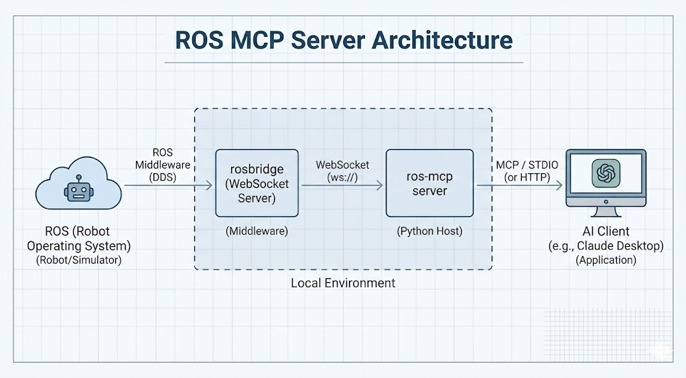

# ros-mcp

[](https://github.com/jonasneves/ros-mcp/actions/workflows/build-push.yml)
[](LICENSE)

Connect AI agents to ROS robots. Exposes topics, services, nodes, parameters, and actions as MCP tools — usable from Claude Desktop, Claude Code, Cursor, or any MCP-compatible client.

Two ways to use it:

| Mode | How | Best for |
|---|---|---|
| **Browser dashboard** | Open [ros-mcp.github.io](https://ros-mcp.github.io), enter rosbridge URL | Quickest start, no install |
| **Python MCP server** | Clone and run with `uv` | Claude Desktop / Cursor / local agents |

## How it works



The browser dashboard skips the Python server entirely — roslibjs connects directly to rosbridge from the browser, with an embedded AI chat panel.

## Quick start

### Browser dashboard

Open [ros-mcp.github.io](https://ros-mcp.github.io), enter your rosbridge WebSocket URL, and connect. No install required.

### Python server

```bash
git clone https://github.com/jonasneves/ros-mcp
cd ros-mcp
ROSBRIDGE_IP=<robot-ip> make server-http
```

Add to your MCP client config (`claude_desktop_config.json`, `.cursor/mcp.json`, etc.):

```json
{
  "ros-mcp": {
    "transport": "http",
    "url": "http://127.0.0.1:9000/mcp"
  }
}
```

**Claude Code** — adds the server as a local stdio MCP:

```bash
make configure
```

**Claude Desktop** — edits `claude_desktop_config.json` automatically:

```bash
make configure-desktop
```

### Docker demo (3× Turtlesim)

```bash
make turtlesim
```

Simulators and rosbridge start automatically. MCP server at `http://localhost:9000/mcp`.

## Tools

### Connection
| Tool | Description |
|---|---|
| `connect_to_robot` | Set rosbridge IP/port and verify connectivity |
| `ping_robot` | Ping an IP and check if a port is open |

### Topics
| Tool | Description |
|---|---|
| `get_topics` | List all topics |
| `get_topic_type` | Message type for a topic |
| `get_topic_details` | Publishers, subscribers, type |
| `get_message_details` | Full message type definition |
| `subscribe_once` | Receive the first message on a topic |
| `subscribe_for_duration` | Collect messages for N seconds |
| `publish_once` | Publish a single message |
| `publish_for_durations` | Publish a sequence of timed messages |
| `turn_by_angle` | Rotate a robot by an exact angle (deg) |
| `move_by_distance` | Move a robot a specified distance (m) |
| `move_robots` | Move multiple robots simultaneously |

### Services
| Tool | Description |
|---|---|
| `get_services` | List all services |
| `get_service_type` | Type for a service |
| `get_service_details` | Request/response structure |
| `call_service` | Call a service with a request payload |

### Nodes
| Tool | Description |
|---|---|
| `get_nodes` | List all nodes |
| `get_connected_robots` | Discover robots by finding cmd_vel topics |
| `get_node_details` | Publishers, subscribers, services for a node |

### Actions (ROS 2)
| Tool | Description |
|---|---|
| `get_actions` | List all actions |
| `get_action_details` | Goal/result/feedback structure |
| `send_action_goal` | Send a goal to an action server |
| `get_action_status` | Check action goal status |
| `cancel_action_goal` | Cancel an action goal |

### Parameters (ROS 2)
| Tool | Description |
|---|---|
| `get_parameter` | Get a parameter value |
| `set_parameter` | Set a parameter value |
| `has_parameter` | Check if a parameter exists |
| `delete_parameter` | Delete a parameter |
| `get_parameters` | List all parameters for a node |
| `get_parameter_details` | Value, type, and metadata for a parameter |

### Robot config
| Tool | Description |
|---|---|
| `detect_ros_version` | Detect ROS version and distro |
| `get_verified_robots_list` | List robots with pre-built specs |
| `get_verified_robot_spec` | Load spec and prompts for a verified robot |

### Images
| Tool | Description |
|---|---|
| `analyze_previously_received_image` | Analyze an image received from a topic |

## Configuration

| Variable | Default | Description |
|---|---|---|
| `ROSBRIDGE_IP` | `127.0.0.1` | rosbridge host |
| `ROSBRIDGE_PORT` | `9090` | rosbridge port |
| `ROS_DEFAULT_TIMEOUT` | `5.0` | Timeout in seconds |

## License

Apache 2.0. See [LICENSE](LICENSE).
